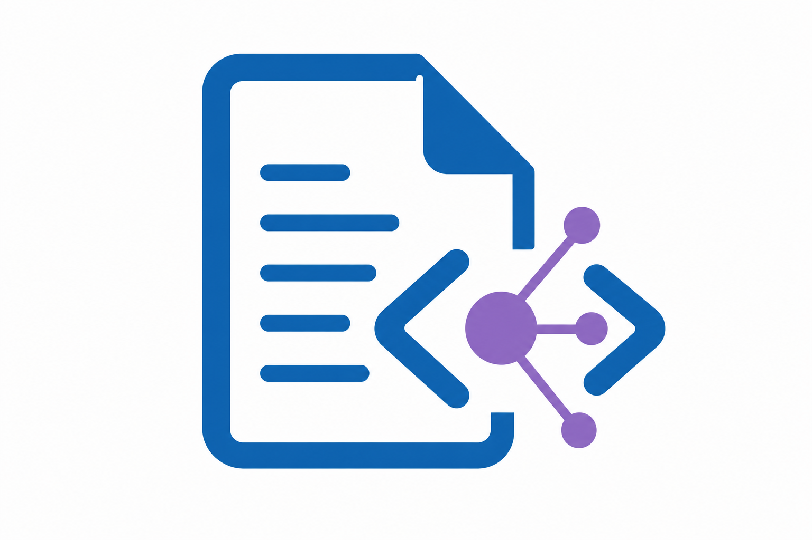

# paper-agent

<p align="center">
  
</p>

[](LICENSE)
[](https://www.python.org/downloads/)

**Onboarding and tooling for writing Overleaf papers in Cursor.**

Clone your project to disk, sync through [Overleaf Workshop](https://github.com/overleaf-workshop/Overleaf-Workshop), optionally install open-source Agent skills, and verify the setup with one command.

> **Not affiliated with Overleaf or Cursor.** Community tooling; use at your own risk and follow [Overleaf’s terms](https://www.overleaf.com/legal).

---

## Table of contents

- [Workspace layout](#workspace-layout)
- [Features](#features)
- [Requirements](#requirements)
- [Quick start](#quick-start)
- [Cookie login](#cookie-login) · [获取 Cookie（中文）](#获取-overleaf-cookie中文步骤)
- [How it works](#how-it-works)
- [Daily workflow](#daily-workflow)
- [Configuration](#configuration)
- [Commands](#commands)
- [Troubleshooting](#troubleshooting)
- [Agent skills](#agent-skills)
- [Docs & license](#docs--license)

---

## Workspace layout

Keep the **git repo** and **local Overleaf replicas** under one parent folder:

```text
paper-agent-workspace/
├── paper-agent/          # clone the repo here
└── papers/               # Method A replicas (../papers/<project>/method-a)
```

See [docs/workspace-layout.md](docs/workspace-layout.md) for migration steps.

### Repo layout

```text
paper-agent/
├── bin/ scripts/ docs/ assets/   # tooling, guides, and logo
├── skill/                        # bundled open-source Agent skills (keep intact)
├── templates/                    # LaTeX gitignore and small helper templates
├── 参考文献/                     # shared .bib and reading notes
├── 参考图片/                     # reference figures and layout shots
├── 参考画图代码/                 # reusable matplotlib / TikZ / PGFPlots snippets
├── 参考模版/                     # custom and partial LaTeX templates
└── 参考同类论文/                 # PDFs and paired .md notes of related work
```

The four `参考*` folders are workspace scratch space for your own references;
they are not part of the core tooling and can be emptied freely. Conference
LaTeX templates already shipped inside `skill/ccf-paper/CCFA-Skills/ccf-latex-templates`
stay there so skill installation keeps working.

---

## Features

- **One-shot onboarding** — `./paper-agent-guide` runs env setup, health checks, replica deploy, skills, and sync tests.
- **Method A (local replica)** — Overleaf project on disk + Workshop Local Replica + optional local Git.
- **Cookie login helper** — configures Workshop for `www.overleaf.com` (SSO) without manual UI copy-paste every time.
- **Sync verification** — `./bin/test-method-a` checks replica layout, Workshop registration, and `main.tex` parity with the cloud.
- **Safe multi-user sync** — `./bin/collab-sync` does a real three-way merge before pushing, so edits from Overleaf web collaborators are not silently overwritten by local agents.
- **Bundled OSS skills** — curated manifest; `./bin/install-skills minimal` symlinks into `.cursor/skills/`.
- **Stdlib-first** — core scripts use Python 3.10+ only; no Qt, no extra deps for the guide itself.

---

## Requirements

| | |
|---|---|
| **Python** | 3.10+ |
| **Editor** | [Cursor](https://cursor.com) (`cursor` on `PATH`) |
| **Extension** | [Overleaf Workshop](https://marketplace.visualstudio.com/items?itemName=iamhyc.overleaf-workshop) |
| **Account** | Overleaf on `www.overleaf.com` |
| **OS** | Linux (primary); Windows via `bin/*.ps1` + WSL recommended |

---

## Quick start

```bash
mkdir -p ~/paper-agent-workspace/papers
git clone git@github.com:yingzhou-bjtu/paper-agent.git ~/paper-agent-workspace/paper-agent
cd ~/paper-agent-workspace/paper-agent
./paper-agent-guide
```

Already have a `.env` with project name and ID? Use the quiet path:

```bash
./paper-agent-guide --quick
```

Skip skill install:

```bash
./paper-agent-guide --skip-skills
```

**Before you run:** create an Overleaf project and note its **name** and **project ID** (from the URL: `/project/<id>`). For `www.overleaf.com` you will need a session cookie—see [Cookie login](#cookie-login) (English) or [获取 Overleaf Cookie（中文）](#获取-overleaf-cookie中文步骤).

---

## How it works

```
Overleaf (cloud)  ←—— Workshop sync ——→  local replica/  ←—— you edit ——→  Cursor
                                              │
                                              └── git/ (optional local history)
```

The guide does six things:

1. Write `.env` (project id/name, paths).
2. Check Workshop is installed and logged in.
3. Download the project ZIP → `../papers/<name>/method-a` (sibling of the repo).
4. Write `.overleaf/settings.json` and register a **Local Replica**.
5. Symlink default [Agent skills](#agent-skills) into `.cursor/skills/`.
6. Run eight checks via `./bin/test-method-a`.

paper-agent does **not** implement its own Overleaf sync protocol—it prepares the folder and config so Workshop can sync on save.

---

## Daily workflow

```bash
./bin/open-overleaf-replica      # open replica in Cursor (usual)
./bin/test-method-a              # when sync feels wrong
./bin/setup-overleaf-project     # re-pull from cloud (overwrites local—backup first)
```

For day-to-day push verification, keep the check lightweight:

1. Confirm the push command returns `OK` for the edited files.
2. Open the Overleaf project and recompile it.
3. Run `./bin/test-method-a` only when sync looks suspicious.

Avoid downloading the whole Overleaf project zip for routine hash checks. Use full-project zip/hash verification only for deep debugging, because Overleaf's zip endpoint can be slow and may make a healthy push look stuck.

### Multi-user collaboration (you on paper-agent, others on Overleaf web)

The Workshop save-on-edit loop pushes a whole file. When a collaborator also
edits the same file on the Overleaf website, the last writer wins and the other
side's edit is lost. `collab-sync` prevents this by keeping a per-file baseline
and doing a three-way merge (it uses `git merge-file` under the hood):

```bash
./bin/collab-sync pull main.tex    # merge cloud edits into your replica
./bin/collab-sync push main.tex    # merge your edit into the cloud
./bin/collab-sync status main.tex  # report divergence without changing anything
```

What happens on `push`:

- Only you changed → plain push.
- Only a web collaborator changed → pull their edit into your replica.
- Both changed different parts → automatic merge, both edits kept.
- Both changed the **same lines** → exit code `1`, no data is overwritten on
  either side; resolve the conflict manually and push again.

The baseline is stored **outside the replica** by default
(`../papers/<project>/.paper-agent-sync`), so it is never uploaded to Overleaf.
For offline rehearsal use `--fake-remote-dir <dir>` to replace Overleaf with a
local directory.

For paper text edits, also run the project-local layout checker before pushing or after any substantial revision:

```powershell
cd ../papers/<project>/method-a
& .\scripts\build-and-check.ps1
```

If MiKTeX emits update warnings on stderr and stops the wrapper, run the checker on the latest log:

```powershell
& .\scripts\check-layout.ps1 -LogFile main.log -TexFile main.tex -ShowContext
```

Treat reported high-badness underfull boxes as likely one-word or two-word lines in the PDF, then shorten, split, or lightly rephrase the referenced paragraph before syncing to Overleaf.

Open the remote virtual workspace instead of the replica:

```bash
./bin/open-overleaf-project 'My Paper Title'
```

### Manual setup

If the guide stops midway, run steps individually:

```bash
./bin/setup-env
./bin/check-cursor-setup          # expect [OK]
./bin/configure-overleaf-cookie   # after OVERLEAF_COOKIE is in .env
./bin/setup-overleaf-project
./bin/install-skills minimal      # restart Cursor after
./bin/test-method-a               # aim for 8× PASS
```

### Cookie login

`www.overleaf.com` uses SSO. The Overleaf Workshop extension cannot use a normal username/password dialog—you must paste a **session cookie** once (same as the [Workshop docs](https://github.com/overleaf-workshop/Overleaf-Workshop#how-to-login-with-cookies)).

**When you need it:** deploying the local replica (`setup-overleaf-project`), opening the remote project, or when `check-cursor-setup` reports cookie/login errors.

**What to copy:** the cookie named **`overleaf_session2`** (value is a long random string).  
You can paste either `overleaf_session2=<value>` **or** the full `Cookie:` header from DevTools—`configure-overleaf-cookie` keeps only the first `name=value` pair.

#### Method A — Application tab (recommended)

Works in **Chrome / Edge / Brave** (Chromium):

1. Log in at [https://www.overleaf.com](https://www.overleaf.com) in your browser.
2. Press **F12** (or right-click → **Inspect**) to open DevTools.
3. Open the **Application** tab (Chrome) or **Storage** tab (Firefox).
4. In the left sidebar: **Storage → Cookies → `https://www.overleaf.com`**.
5. Find the row **`overleaf_session2`**, click it, and copy the **Value** column (double-click the value → Ctrl+C).
6. In `paper-agent/.env`, set:

   ```env
   OVERLEAF_COOKIE=overleaf_session2=PASTE_THE_VALUE_HERE
   ```

   Use the real value with **no** quotes unless your shell requires them inside `.env`.

7. Apply it to Cursor Workshop:

   ```bash
   ./bin/configure-overleaf-cookie
   ```

8. **Restart Cursor**, then open the Overleaf Workshop sidebar and refresh your project list.

#### Method B — Network tab (full Cookie header)

1. Log in at [https://www.overleaf.com](https://www.overleaf.com).
2. Open DevTools → **Network**.
3. Refresh the page or open your project list so a request to `www.overleaf.com` appears.
4. Click any request to `www.overleaf.com` (e.g. `/project`, `/project/<id>`, or the document).
5. In **Headers → Request Headers**, find **`Cookie:`**.
6. Copy the entire cookie string, or only the `overleaf_session2=...` segment (stop at the next `;` if copying manually).
7. Put it in `.env` as `OVERLEAF_COOKIE=...`, then run `./bin/configure-overleaf-cookie` and restart Cursor.

#### Example `.env` line

```env
OVERLEAF_COOKIE=overleaf_session2=s%3Axxxxxxxxxxxxxxxxxxxxxxxxxxxxxxxx.yyyyyyyyyyyyyyyyyyyyyyyyyyyyyyyy
```

(Your value will differ; it often starts with `s%3A` and contains a dot.)

#### Verify

```bash
./bin/check-cursor-setup    # should show login OK for www.overleaf.com
./bin/test-method-a           # after replica is deployed
```

#### If deploy fails with HTTP 403

The cookie may be **expired** or the **project ID** is wrong. Log in again in the browser, copy a fresh `overleaf_session2`, update `.env`, run `./bin/configure-overleaf-cookie`, and restart Cursor.

#### Security

- `overleaf_session2` is equivalent to your logged-in session—**do not commit `.env`**, paste it in chat, or share screenshots that show the value.
- Prefer `.env` over `./bin/configure-overleaf-cookie --cookie '...'` on the command line (visible in `ps`). See [SECURITY.md](SECURITY.md).

---

### 获取 Overleaf Cookie（中文步骤）

**为什么需要：** 在 `www.overleaf.com` 上，Overleaf Workshop 插件使用 **Cookie 登录**，不能用网页账号密码直接填进插件。paper-agent 需要 Cookie 才能从云端拉取项目、检查登录状态。

**要复制哪一项：** 浏览器里名为 **`overleaf_session2`** 的 Cookie（一长串字符）。

#### 方法一：Application / 应用（推荐）

1. 浏览器打开 [https://www.overleaf.com](https://www.overleaf.com) 并**登录**。
2. 按 **F12** 打开开发者工具。
3. 切到 **Application（应用）** 面板（Firefox 为 **存储**）。
4. 左侧展开：**Cookies → `https://www.overleaf.com`**。
5. 在列表中找到 **`overleaf_session2`**，复制右侧 **Value（值）** 整段。
6. 编辑 `paper-agent/.env`，写入：

   ```env
   OVERLEAF_COOKIE=overleaf_session2=这里粘贴刚才复制的值
   ```

7. 在仓库根目录执行：

   ```bash
   ./bin/configure-overleaf-cookie
   ```

8. **重启 Cursor**，在 Overleaf Workshop 侧边栏刷新项目列表。

#### 方法二：Network / 网络

1. 登录 Overleaf 后打开开发者工具 → **Network（网络）**。
2. 刷新页面或打开项目列表。
3. 选中任意一条 `www.overleaf.com` 的请求。
4. 在 **Headers（标头）→ Request Headers** 里找到 **`Cookie:`**。
5. 复制整段 Cookie，或只复制 `overleaf_session2=...`（到下一个分号 `;` 为止）。
6. 写入 `.env` 的 `OVERLEAF_COOKIE=`，再执行 `./bin/configure-overleaf-cookie`，重启 Cursor。

#### 常见问题

| 现象 | 处理 |
| --- | --- |
| `check-cursor-setup` 提示未登录 | Cookie 未配置或已过期，按上面步骤重新复制 |
| 部署项目 HTTP 403 | 检查 `OVERLEAF_PROJECT_ID` 是否正确；重新登录 Overleaf 并更新 Cookie |
| Cookie 多久失效 | 随 Overleaf 会话过期，失效后按同样步骤重新获取 |

**注意：** Cookie 相当于登录凭证，不要提交到 Git、不要发到公开渠道。`.env` 已在 `.gitignore` 中。

---

## Configuration

Copy [`.env.example`](.env.example) or run `./bin/setup-env`. **Do not commit `.env`.**

| Variable | Required | Description |
|----------|:--------:|-------------|
| `OVERLEAF_PROJECT_NAME` | ✓ | Name in the Overleaf UI |
| `OVERLEAF_PROJECT_ID` | ✓ | 24-char hex from project URL |
| `OVERLEAF_COOKIE` | * | Session cookie (`overleaf_session2=...`) for deploy / API checks — see [Cookie login](#cookie-login) |
| `OVERLEAF_METHOD_A_DIR` | | Default `../papers/<name>/method-a` |
| `PAPER_AGENT_ROOT` | | Leave empty → auto-detect repo root |
| `REFERENCES_DIR` | | Default `参考文献` (relative to repo) |
| `EXPERIMENT_CODE_DIR` | | Default `实验代码` (relative to repo) |

\* Required unless Workshop is already logged in and checks pass.

Use **relative paths** inside the repo and `~/...` for the replica. Avoid machine-specific absolute paths.

---

## Commands

| Command | Description |
|---------|-------------|
| [`./paper-agent-guide`](paper-agent-guide) | Full onboarding wizard |
| `./bin/setup-env` | Interactive `.env` |
| `./bin/check-cursor-setup` | Workshop install + login |
| `./bin/configure-overleaf-cookie` | Apply cookie to Cursor state |
| `./bin/setup-overleaf-project` | Deploy / refresh local replica |
| `./bin/open-overleaf-replica` | `cursor -r` on replica |
| `./bin/open-overleaf-project` | Open remote Overleaf project |
| `./bin/test-method-a` | Verify replica + sync (`--live` for push test) |
| `./bin/collab-sync <pull|push|status> <file>` | Safe three-way merge with Overleaf web collaborators |
| `./bin/install-skills [preset]` | Link skills (`minimal`, `research`, …) |
| `./bin/audit-release` | Privacy / compliance scan (maintainers) |
| `./bin/vendor-skills --all` | Re-download vendored skills (maintainers) |

Presets are defined in [`skill/manifest.json`](skill/manifest.json).

---

## Troubleshooting

<details>
<summary><strong>Workshop not logged in / ACTION REQUIRED</strong></summary>

Refresh the cookie in the browser, update `.env`, run `./bin/configure-overleaf-cookie`, **restart Cursor**.
</details>

<details>
<summary><strong>HTTP 403 when deploying</strong></summary>

Wrong `OVERLEAF_PROJECT_ID` or expired cookie. Fix `.env` and refresh the session.
</details>

<details>
<summary><strong><code>cursor</code> not found</strong></summary>

Cursor → Command Palette → **Shell Command: Install 'cursor' command in PATH**.
</details>

<details>
<summary><strong><code>test-method-a</code> failures</strong></summary>

| Check fails | Fix |
|-------------|-----|
| Replica missing | `./bin/setup-overleaf-project` |
| No `main.tex` | Add main file on Overleaf; redeploy |
| Bad `settings.json` | Redeploy; avoid hand-editing unless you know the Workshop URI |
| Local Replica not registered | Open replica folder once in Cursor; check Workshop panel |
| Local ≠ remote `main.tex` | Save in Cursor to push, or redeploy to pull (**destroys unsynced local edits**) |

You want eight `[PASS]` lines and `结果: 通过` at the end.

If a manual push script already returned `OK`, prefer an Overleaf recompile as the first confirmation. Full-project zip/hash comparison is a last-resort diagnostic, not the default verification path.
</details>

<details>
<summary><strong>Skills not showing in Cursor</strong></summary>

Run `./bin/install-skills minimal`, then **restart Cursor**. Skills live under `.cursor/skills/` (gitignored symlinks).
</details>

<details>
<summary><strong><code>ModuleNotFoundError</code> from a skill script</strong></summary>

`pip install -r requirements.txt` — only needed for skill scripts, not for the guide.
</details>

More detail: [SECURITY.md](SECURITY.md) · [COMPLIANCE.md](COMPLIANCE.md)

---

## Agent skills

Open-source skills only (`open_source: true` in the manifest). Default bundle:

```bash
./bin/install-skills minimal
```

Some upstream licenses differ (e.g. **CC-BY-NC** on `academic-research-skills` — no commercial use). See [THIRD_PARTY_NOTICES.md](THIRD_PARTY_NOTICES.md).

You are responsible for your venue’s AI and authorship policies.

---

## Docs & license

| Document | |
|----------|--|
| [COMPLIANCE.md](COMPLIANCE.md) | Redistribution, disclaimers, academic use |
| [SECURITY.md](SECURITY.md) | Cookies, secrets, reporting |
| [THIRD_PARTY_NOTICES.md](THIRD_PARTY_NOTICES.md) | Upstream skill licenses |
| [docs/workspace-layout.md](docs/workspace-layout.md) | Parent folder + `papers/` layout |
| [skill/README.md](skill/README.md) | Skill layout and presets |

**License:** [MIT](LICENSE) for paper-agent code. Bundled skills remain under their upstream licenses.

---

<p align="center">
  <sub>Built for researchers who want Overleaf collaboration and a local editor in the same loop.</sub>
</p>
