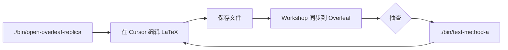

# paper-agent

在 **Cursor** 里写 **Overleaf** 论文时，常见张力有三类：云端协作与本地 Git 版本管理难以兼得；`www.overleaf.com` 的 SSO 使插件无法仅靠账号密码登录；Agent Skills 分散在各仓库，难以一次性链到 IDE。paper-agent 用一条 **Method A（本地副本 + Workshop 同步）** 工作流和命令行引导，把环境配置、Cookie 登录、副本部署、Skill 安装与同步验证串成可重复的流水线。

**范围说明：** 本仓库提供脚本与开源 Skill 清单，**非** Overleaf 或 Cursor 官方产品。核心引导仅需 **Python 3.10+ 标准库**；完整 Skill 脚本可能还需 `pip install -r requirements.txt`（见下文）。Linux 上已验证；Windows 提供 `.ps1` 包装，行为以 Bash 版为准。

---

## 前置条件

| 项 | 要求 |
|----|------|
| Python | 3.10+（`python3 --version`） |
| Cursor | 已安装，命令行可用 `cursor`（或在 PATH 中） |
| Overleaf Workshop | 扩展 `iamhyc.overleaf-workshop`（引导会检查） |
| Overleaf 账号 | 可浏览器登录 `www.overleaf.com` |
| 网络 | 可访问 Overleaf 与 GitHub（克隆 Skill 时） |

---

## 端到端运行流程

### 路径 A：一键引导（推荐）

```bash
git clone git@github.com:yingzhou-bjtu/paper-agent.git   # 或你的 fork
cd paper-agent
./paper-agent-guide          # 交互式，逐步确认
# 或
./paper-agent-guide --quick  # 少提问；.env 已有项目名与 ID 时会保留
```

引导程序 **6 步** 与底层命令的对应关系：

| 步骤 | 引导动作 | 等价命令 | 通过标准 |
|------|----------|----------|----------|
| 1/6 | 生成或保留 `.env` | `./bin/setup-env` | 存在 `.env`，且含 `OVERLEAF_PROJECT_NAME`、`OVERLEAF_PROJECT_ID` |
| 2/6 | Cursor / Overleaf 检查 | `./bin/check-cursor-setup` | Workshop 已安装且至少一服务器已登录 |
| 3/6 | 部署 Method A | `./bin/setup-overleaf-project` | 本地副本目录、`main.tex`、`.overleaf/settings.json`、Git 已就绪 |
| 4/6 | 安装 Skills | `./bin/install-skills minimal` | `.cursor/skills/` 下出现 6 个软链 |
| 5/6 | 验证同步 | `./bin/test-method-a` | 报告 **8/8 PASS**（或见故障排查） |
| 6/6 | 完成 | — | 可开始日常写作 |

可选参数：

```bash
./paper-agent-guide --skip-skills   # 跳过 Skill 安装
```

Windows：`.\bin\paper-agent-guide.ps1`（逻辑同 Bash 版）。

### 路径 B：手动分步（便于定位失败环节）

```bash
# 1. 配置环境（交互式）
./bin/setup-env
# 或非交互默认骨架（不含 Cookie，不覆盖已有项目字段的逻辑见 setup-env）
./bin/setup-env --defaults-only

# 2. 检查 Workshop
./bin/check-cursor-setup

# 3. Cookie 登录（www.overleaf.com 通常必需）
./bin/configure-overleaf-cookie --cookie 'overleaf_session2=...'
# 更安全：把 Cookie 写入 .env 的 OVERLEAF_COOKIE，再运行 configure（读取环境变量）

# 4. 拉取云端项目到本地副本
./bin/setup-overleaf-project

# 5. 安装推荐 Skills
./bin/install-skills minimal

# 6. 验证
./bin/test-method-a
```

### 日常写作循环（部署成功后）



| 场景 | 命令 |
|------|------|
| 打开本地副本（推荐） | `./bin/open-overleaf-replica` |
| 打开远程虚拟工作区 | `./bin/open-overleaf-project '<Overleaf 项目名>'` |
| 再次全量验证 | `./bin/test-method-a` |
| 仅刷新副本（云端有更新） | `./bin/setup-overleaf-project` |

本地副本默认路径：`~/papers/<OVERLEAF_PROJECT_NAME>/method-a`，可在 `.env` 用 `OVERLEAF_METHOD_A_DIR` 覆盖。

**路径约定：** 仓库内目录用相对路径（如 `参考文献`）；Method A 用 `~/papers/...`。`PAPER_AGENT_ROOT` 留空即可自动检测。

---

## Method A 机制（为何这样设计）

1. **从 Overleaf 下载 ZIP** 到本地目录（`setup-overleaf-project`）。
2. 写入 **`.overleaf/settings.json`**，使 Workshop 把该文件夹识别为与云端项目绑定的 **Local Replica**。
3. 在 Cursor 全局状态中 **注册 Local Replica**，保存时在本地与云端之间同步。
4. 可选 **本地 Git**（`method-a` 目录内 `git init`），便于 diff 与备份；与 Overleaf 历史版本相互独立。

诚实边界：同步依赖 Workshop 插件与有效 Cookie；paper-agent **不**实现独立的 Overleaf API 客户端替代官方同步链路。

---

## 配置 `.env`

复制模板或运行 `./bin/setup-env`。`.env` **已 gitignore，切勿提交**。

| 变量 | 必填 | 说明 | 如何获取 |
|------|------|------|----------|
| `OVERLEAF_PROJECT_NAME` | 是 | Overleaf 网页上的项目名 | 项目列表显示名称 |
| `OVERLEAF_PROJECT_ID` | 是 | 24 位十六进制 ID | 浏览器 URL：`/project/<ID>` |
| `OVERLEAF_COOKIE` | 是* | `overleaf_session2=...` | 浏览器已登录 → F12 → Application → Cookies |
| `OVERLEAF_METHOD_A_DIR` | 否 | 本地副本路径 | 默认 `~/papers/<项目名>/method-a` |
| `PAPER_AGENT_ROOT` | 否 | 本仓库根目录 | **留空**自动检测；或相对路径 |
| `CURSOR_USER_DATA_DIR` | 否 | Cursor 用户数据 | **留空**自动检测 |
| `REFERENCES_DIR` / `EXPERIMENT_CODE_DIR` | 否 | 参考文献 / 实验代码 | 默认 `参考文献`、`实验代码`（相对仓库根） |

\* 若 Workshop 已通过 UI 完成 Cookie 登录且 `check-cursor-setup` 通过，可先不写入 `.env`，但 Method A 部署与测试仍建议配置一致。

模板文件：`.env.example`（可提交，无真实私密信息）。

---

## 命令索引

| 命令 | 作用 |
|------|------|
| `./paper-agent-guide` | 一键引导 |
| `./bin/setup-env` | 交互式生成 `.env` |
| `./bin/check-cursor-setup` | 检查 Workshop 安装与登录 |
| `./bin/configure-overleaf-cookie` | 将 Cookie 写入 Cursor 状态 |
| `./bin/setup-overleaf-project` | 部署 / 刷新 Method A 本地副本 |
| `./bin/open-overleaf-replica` | Cursor 打开本地副本 |
| `./bin/open-overleaf-project` | Cursor 打开远程项目 |
| `./bin/test-method-a` | 静态 + 可选 live 同步测试 |
| `./bin/install-skills [preset]` | 软链 Skill 到 `.cursor/skills/` |
| `./bin/vendor-skills --all` | 维护者：下载全部开源 Skill 到 `skill/` |
| `./bin/audit-release` | 发布前隐私与 manifest 合规扫描 |

Preset：`minimal`（默认）、`research`、`ccf`、`ieee`、`figure` — 见 `skill/manifest.json`。

---

## 故障排查：现象 → 原因 → 处理

按 **test-method-a** 检查项与常见安装问题组织；优先从上往下排除。

### 1. 环境与登录

| 现象 | 可能原因 | 处理 |
|------|----------|------|
| `check-cursor-setup` 报 **ACTION REQUIRED**，未登录 | 未配置 Cookie 或会话过期 | 浏览器重新登录 Overleaf → 复制 `overleaf_session2` → `./bin/configure-overleaf-cookie`；写入 `.env` 后重试 |
| 检查通过但部署失败 / HTTP 403 | Cookie 无效或项目 ID 错误 | 核对 `.env` 中 `OVERLEAF_PROJECT_ID` 与 URL 一致；刷新 Cookie |
| 找不到 `cursor` 命令 | CLI 未加入 PATH | 在 Cursor 中执行 “Shell Command: Install 'cursor' command in PATH” |
| `未找到 Overleaf Workshop 登录信息` | 从未配置或 `CURSOR_USER_DATA_DIR` 指错 | 确认 Cursor 数据目录；运行 `configure-overleaf-cookie` 后 **重启 Cursor** |

**Cookie 安全：** 勿把 Cookie 提交到 Git；尽量避免 `configure-overleaf-cookie --cookie '...'`（会出现在进程列表），优先写入 `.env`。详见 [SECURITY.md](SECURITY.md)。

### 2. `.env` 与项目配置

| 现象 | 可能原因 | 处理 |
|------|----------|------|
| `请在 .env 中设置 OVERLEAF_PROJECT_NAME 和 OVERLEAF_PROJECT_ID` | 字段为空 | `./bin/setup-env` 或手动编辑 `.env` |
| `open-overleaf-replica` 打开错误目录 | `OVERLEAF_METHOD_A_DIR` 未设且项目名为空 | 填写 `OVERLEAF_PROJECT_NAME` 或显式设置 `OVERLEAF_METHOD_A_DIR` |
| `--quick` 后项目字段被清空 | 旧版行为；当前版在已有 name+id 时会保留 | 升级后重新 `./bin/setup-env` 补全 |

### 3. Method A 部署与同步（`test-method-a`）

| 检查项 FAIL | 可能原因 | 处理 |
|-------------|----------|------|
| 本地副本目录不存在 | 未运行 `setup-overleaf-project` | `./bin/setup-overleaf-project` |
| `main.tex` 不存在 | 云端项目无 `main.tex` 或 ZIP 解压失败 | 在 Overleaf 确认主文件；重跑部署 |
| `settings.json` 缺失或配置错误 | 部署中断或手动改坏 | 重跑 `setup-overleaf-project`；核对 URI 含正确 `project=` |
| Git 未初始化 | 首次部署异常 | 删除副本目录后重新部署，或于副本内 `git init` |
| Cookie 登录有效 **FAIL** | 会话过期 | 重新配置 Cookie |
| **Cursor 已注册 Local Replica** FAIL | 未在 Workshop 中打开过该文件夹 | `cursor -r <副本路径>` 打开一次，在 Workshop 面板确认项目绑定 |
| **本地与云端 main.tex 不一致** | 本地有未同步修改或云端刚更新 | 在 Cursor 保存触发同步；或 `./bin/setup-overleaf-project` 重新拉取（**会覆盖本地未推送修改，先备份**） |

全部通过后应看到：

```text
结果: 通过
```

可选实时同步测试（会短暂修改 `main.tex` 引言段）：

```bash
./bin/test-method-a --live
```

### 4. Agent Skills

| 现象 | 可能原因 | 处理 |
|------|----------|------|
| Cursor 中看不到 Skill | 未安装或未重启 | `./bin/install-skills minimal` 后 **重启 Cursor** |
| `跳过（无 SKILL.md）` | `skill/` 副本不完整 | `./bin/vendor-skills --preset minimal` 或删除对应目录后 `install-skills` 自动克隆 |
| `合规 (...): 发布前请向上游确认 LICENSE` | figure 类 skill 许可证未在快照中核实 | 个人使用可忽略；**公开发布 fork 前** 见 [THIRD_PARTY_NOTICES.md](THIRD_PARTY_NOTICES.md) |
| `安装失败` / git clone 超时 | 网络或 GitHub 不可达 | 配置代理后重试；或手动克隆 manifest 中的 `repo` 到 `clone_dir` |

安装后 Skill 位于 `.cursor/skills/`（软链，已 gitignore）。**私有 Skill（如个人写作 skill）不要放入本仓库**；在 Cursor 用户级 `~/.cursor/skills/` 单独管理。

### 5. 依赖与平台

| 现象 | 可能原因 | 处理 |
|------|----------|------|
| 引导 / Method A 脚本报错 | Python &lt; 3.10 | 升级 Python |
| 某 Skill 脚本报 `ModuleNotFoundError` | 未装 Skill 依赖 | `pip install -r requirements.txt`（**仅 Skill 需要，非引导必需**） |
| Windows 下路径异常 | Bash 与 PowerShell 行为差异 | 优先 WSL；或使用 `bin/*.ps1`，并手填 `CURSOR_*` 路径 |

---

## 完成态自检清单

部署完成后，建议逐项确认：

- [ ] `./bin/check-cursor-setup` 为 **OK**
- [ ] `./bin/test-method-a` **8/8 PASS**
- [ ] `./bin/open-overleaf-replica` 能在 Cursor 打开副本且 Workshop 显示正确项目
- [ ] 编辑 `main.tex` 保存后，Overleaf 网页端能看到变更
- [ ] `.env` 未出现在 `git status` 中
- [ ] （可选）`./bin/install-skills minimal` 已执行且已重启 Cursor

---

## Agent Skills

仅收录 **`open_source: true`** 的上游 Skill（见 [`skill/manifest.json`](skill/manifest.json)）。`minimal` preset 含 6 个常用写作 / 模板 / 画图 skill；仓库内 `skill/` 可为预置副本，也可由 `install-skills` 按需克隆。

```bash
./bin/install-skills minimal    # 推荐
./bin/install-skills research   # 含 academic-research-skills（CC-BY-NC，禁止商用）
```

许可证与再分发义务见 [COMPLIANCE.md](COMPLIANCE.md)、[THIRD_PARTY_NOTICES.md](THIRD_PARTY_NOTICES.md)。安装时终端会打印 **合规提示**（如 NC 许可、license 未核实项）。

---

## 合规与安全

| 文档 | 内容 |
|------|------|
| [COMPLIANCE.md](COMPLIANCE.md) | 第三方再分发、Overleaf/Cursor 免责、学术诚信 |
| [THIRD_PARTY_NOTICES.md](THIRD_PARTY_NOTICES.md) | 各 Skill 许可证一览 |
| [SECURITY.md](SECURITY.md) | Cookie / `.env`、git 历史清洗建议 |
| [LICENSE](LICENSE) | paper-agent 本体（MIT） |

使用 bundled Skills 辅助写作时，须自行遵守目标期刊 / 会议的 **AI 使用与作者署名** 政策；paper-agent 不保证生成内容符合任何特定期刊要求。

---

## 维护者与发布

```bash
./bin/audit-release                              # 推送前扫描私人信息与 manifest 字段
cp .audit-denylist.example .audit-denylist      # 可选：加强个人敏感词检测（不提交）
./bin/vendor-skills --all                        # 更新 skill/ 预置副本后同步 THIRD_PARTY_NOTICES.md
```

- `skill/manifest.json` 禁止 `open_source: false` 条目  
- 私有 Overleaf 配置仅保留在本地 `.env`

---

## 仓库结构（简图）

```text
paper-agent/
├── paper-agent-guide      # 根入口 → bin/paper-agent-guide
├── bin/                   # 可执行包装脚本
├── scripts/               # Python 实现
├── skill/                 # 开源 Skill 副本 + manifest.json
├── templates/             # 如 method-a 用 .gitignore 模板
├── 参考文献/  实验代码/    # 本地工作目录占位
└── .env                   # 本地配置（gitignore）
```
